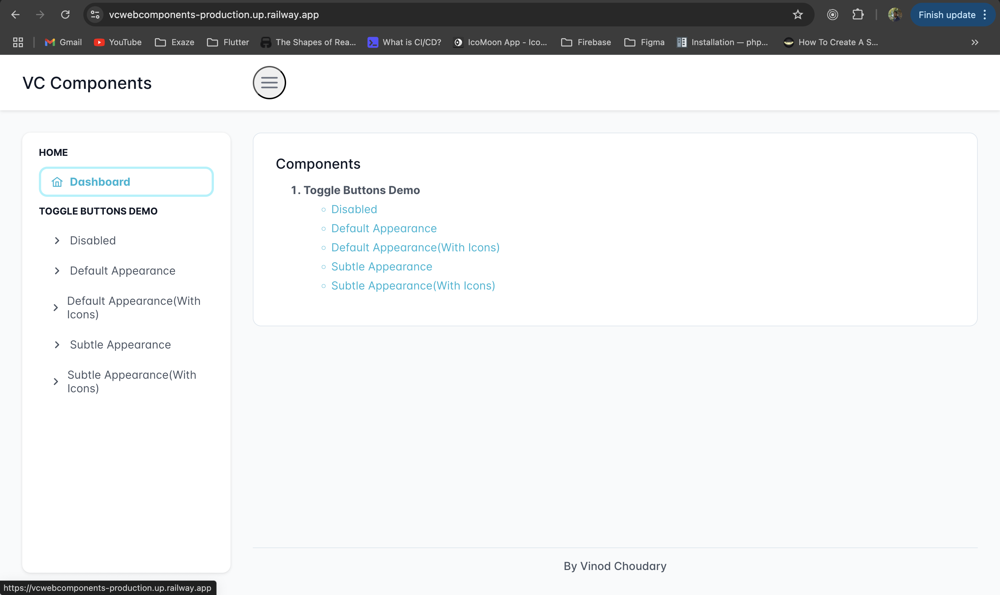
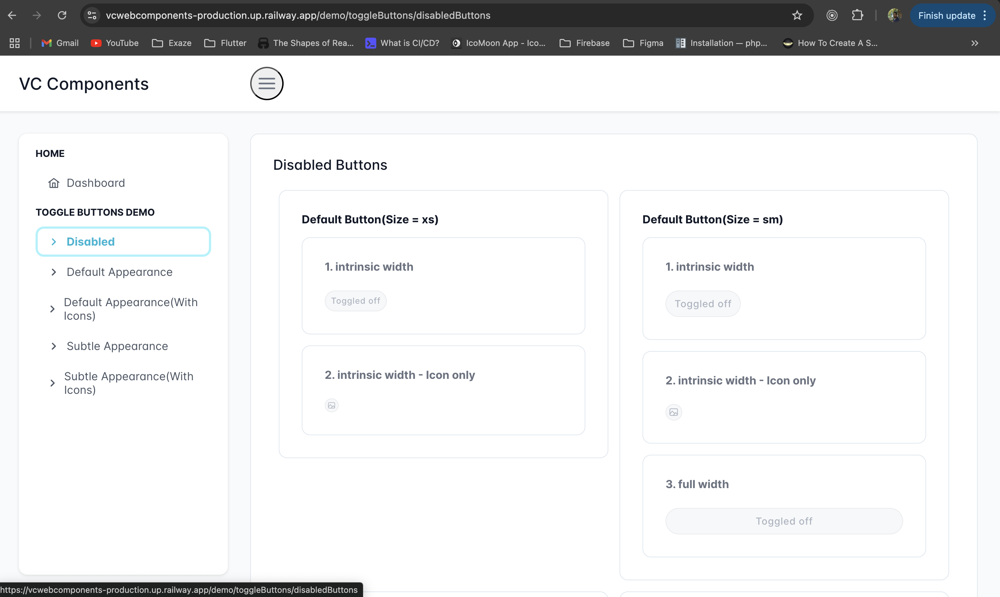
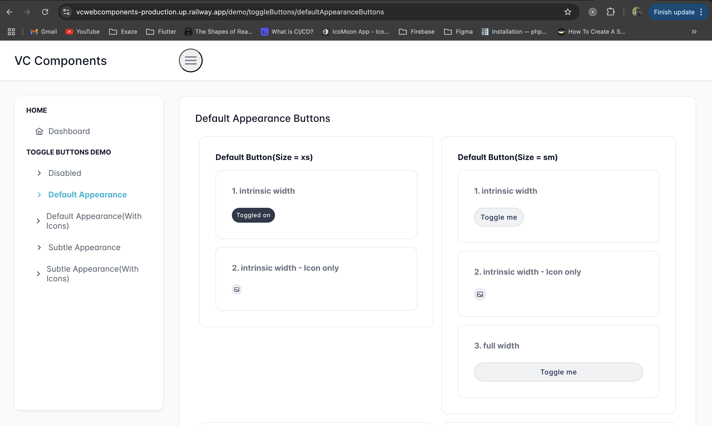
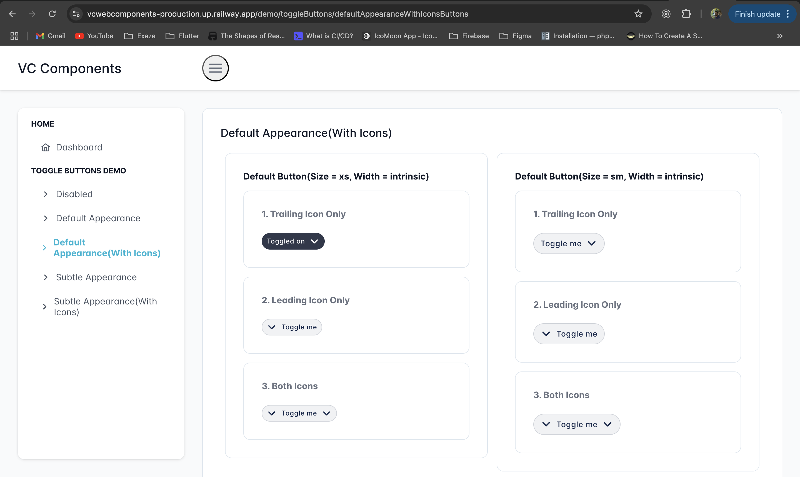
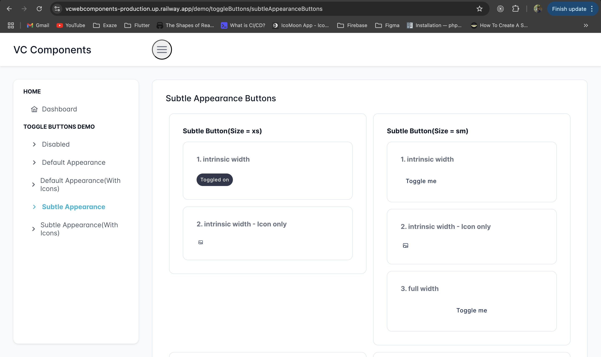
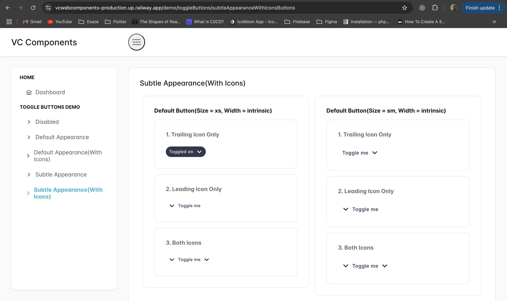

# vc_web_components

This is a React project with [Next.js](https://nextjs.org) framework bootstrapped with [`create-next-app`](https://nextjs.org/docs/app/api-reference/cli/create-next-app). [PrimeReact](https://primereact.org/installation/) framework is used for only for providing nice look and implementing menu in less time. The port for local development is `6001`. You can change the port you want in `scripts` in `package.json` file.

## Getting Started

First, install the packages:

```bash
yarn install
```

Second, run the development server:

```bash
yarn run dev
```

Open [http://localhost:6001](http://localhost:6001) with your browser to see the result.

You can start editing the page by modifying `app/page.tsx`. The page auto-updates as you edit the file.

This project uses [`next/font`](https://nextjs.org/docs/app/building-your-application/optimizing/fonts) to automatically optimize and load [Geist](https://vercel.com/font), a new font family for Vercel.

## Project Structure

All developed Components sits in `app/components` directory. Demo pages to show the demo of components variantions are in `app/demo`,

```bash
.
├── README.md
├── __tests__
│   ├── VCToggleButton.test.tsx
│   └── __snapshots__
│       └── VCToggleButton.test.tsx.snap
├── app
│   ├── components
│   │   └── vcToggleButton
│   │       └── VCToggleButton.tsx
│   ├── demo
│   │   └── toggleButtons
│   │       ├── defaultAppearanceButtons
│   │       │   └── page.tsx
│   │       ├── defaultAppearanceWithIconsButtons
│   │       │   └── page.tsx
│   │       ├── disabledButtons
│   │       │   └── page.tsx
│   │       ├── subtleAppearanceButtons
│   │       │   └── page.tsx
│   │       └── subtleAppearanceWithIconsButtons
│   │           └── page.tsx
│   ├── favicon.ico
│   ├── layout.tsx
│   ├── page.tsx
│   └── utils
│       └── CommonUtils.ts
├── docs
│   └── assets
│       └── images
│           ├── dashboard.png
│           ├── default_appearance_btns.png
│           ├── default_appearance_with_icons_btns.png
│           ├── disabled_btns.png
│           ├── subtle_appearance_btns.png
│           └── subtle_appearance_with_icons_btns.png
├── eslint.config.mjs
├── jest
│   └── jest.setup.js
├── jest.config.js
├── layout
│   ├── AppFooter.tsx
│   ├── AppMenu.tsx
│   ├── AppMenuitem.tsx
│   ├── AppSidebar.tsx
│   ├── AppTopbar.tsx
│   ├── context
│   │   ├── layoutcontext.tsx
│   │   └── menucontext.tsx
│   └── layout.tsx
├── mockedData
│   ├── defaultAppearanceBtnsData.ts
│   ├── defaultAppearanceWithIconsBtnsData.ts
│   ├── disabledButtonsData.ts
│   ├── subtleAppearanceBtnsData.ts
│   └── subtleAppearanceWithIconsBtnsData.ts
├── next-env.d.ts
├── next.config.ts
├── package.json
├── public
│   ├── file.svg
│   ├── globe.svg
│   ├── next.svg
│   ├── themes
│   │   └── lara-light-cyan
│   │       ├── fonts
│   │       │   ├── Inter-italic.var.woff2
│   │       │   └── Inter-roman.var.woff2
│   │       └── theme.css
│   ├── vercel.svg
│   └── window.svg
├── styles
│   └── layout
│       ├── _config.scss
│       ├── _content.scss
│       ├── _footer.scss
│       ├── _main.scss
│       ├── _menu.scss
│       ├── _mixins.scss
│       ├── _responsive.scss
│       ├── _topbar.scss
│       ├── _typography.scss
│       ├── _utils.scss
│       ├── _variables.scss
│       ├── _vcToggleButton.scss
│       └── layout.scss
├── tsconfig.json
├── types
│   ├── buttonsPage.d.ts
│   ├── dashboard.d.ts
│   ├── index.d.ts
│   ├── layout.d.ts
│   └── vcToggleButton.d.ts
├── yarn-error.log
└── yarn.lock
```

## Typescript

Typescript version@5 is installed. TSConfig is configured to ensure developer will add types in code.

## ESLint

ESLint is configured to ensure the quality of code. ESLint version@9 is installed.

## Unit Tests

Unit testcases for testing the developed component are written using `Jest` and `@testing-library`.

For running testcases:

```bash
yarn run test
```

One can update the snapshots if there is a change in screen rendering:

```bash
yarn run test -- -u
```

## Production

Its hosted on Azure as static web app [vc_web_components_prod](https://blue-tree-099ba8910.4.azurestaticapps.net/)

## Project Demo

### 1. Dashboard:



### 2. Disabled Buttons:



### 3. Default Appearance Of Buttons:



### 4. Default Appearance Of Buttons With Leading & Trailing Icons:



### 5. Subtle Appearance Of Buttons:



### 6. Subtle Appearance Of Buttons With Leading & Trailing Icons:


